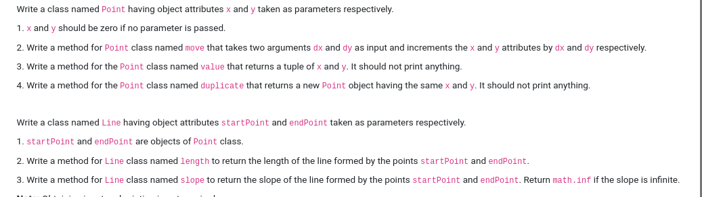
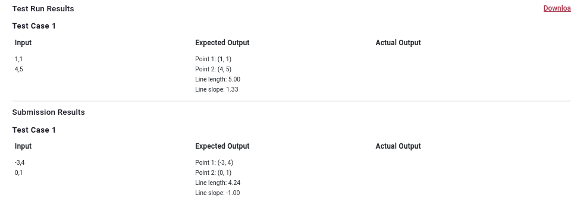

```

pt1 = Point()
pt2 = pt1.duplicate()

inp1 = input().strip().split(',')
inp2 = input().strip().split(',')

pt1.move(int(inp1[0]),int(inp1[1]))
pt2.move(int(inp2[0]),int(inp2[1]))

print(f'Point 1: {pt1.value()}')
print(f'Point 2: {pt2.value()}')

l1 = Line(pt1, pt2)
print(f'Line length: {l1.length():.2f}')
print(f'Line slope: {l1.slope():.2f}')
```
