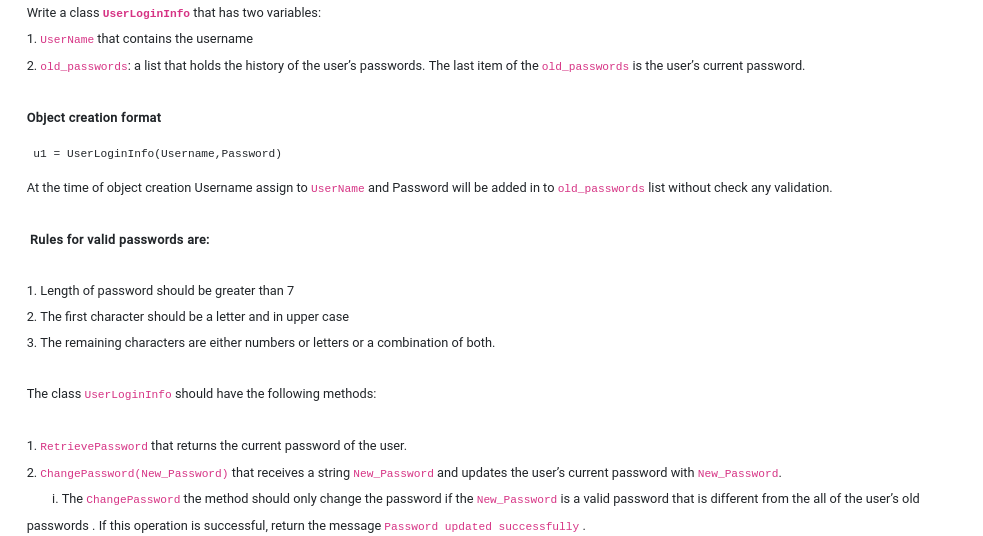
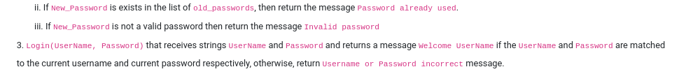
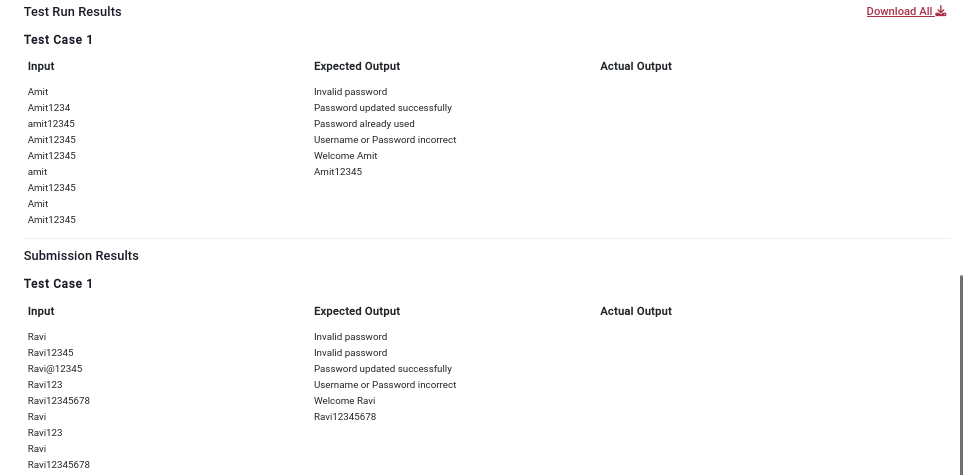

```
u1 = UserLoginInfo(input(),input())
a = u1.ChangePassword(input())
b = u1.ChangePassword(input())
c = u1.ChangePassword(input())
d = u1.Login(input(),input())
e = u1.Login(input(),input())
f = u1.RetrievePassword()
print(a)
print(b)
print(c)
print(d)
print(e)
print(f)
```
