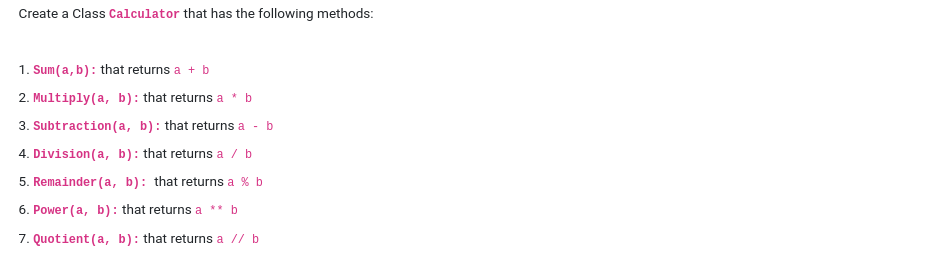
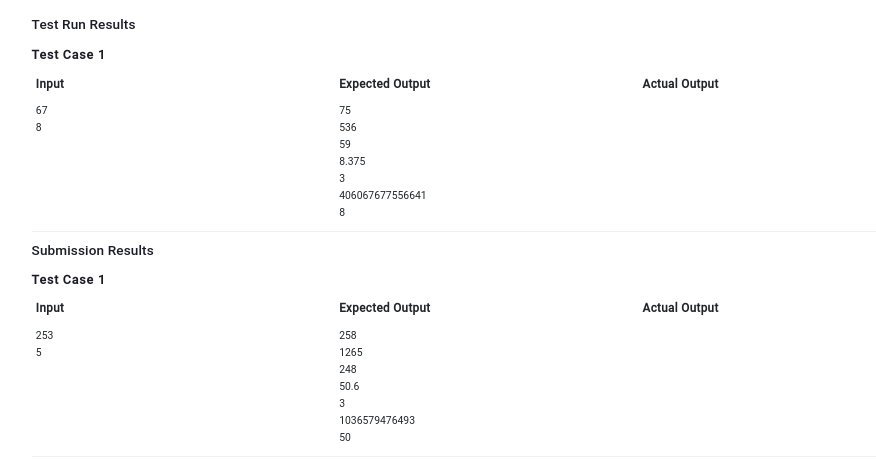

```

a = int(input())
b = int(input())
x = Calculator()
print(x.Sum(a,b))
print(x.Multiply(a, b))
print(x.Subtraction(a, b))
print(x.Division(a, b))
print(x.Remainder(a, b))
print(x.Power(a, b))
print(x.Quotient(a, b))
```

