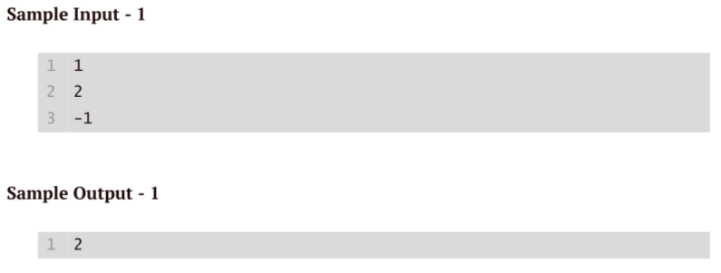

### Write a code to accept the sequence of positive integers in sorted order(either in non ascending order or non descending order) ending with -1 and at least two integers must be before -1 . In Output print the number of distinct elements in the sorted sequence before -1.
