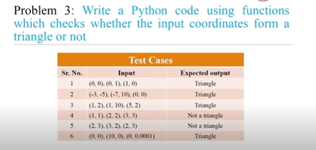

- to check if the coordinates form a triangle or not
- you can use the formula
    - if the sum of any two sides is greater than the third side then it forms a triangle

- take 6 inputs from the user as float
    - x1,y1,x2,y2,x3,y3
- create a function distance(x1,y1,x2,y2) to calculate the distance between two points

- formula for distance between two points
    - sqrt((x2-x1)^2 + (y2-y1)^2)