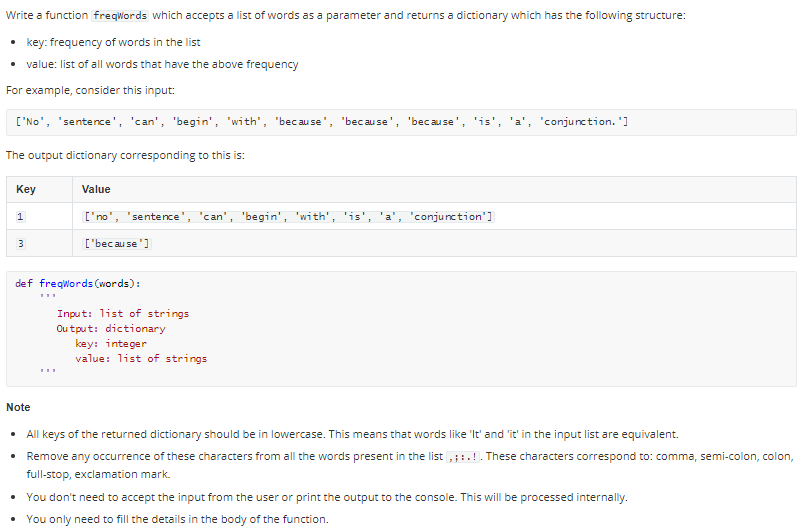
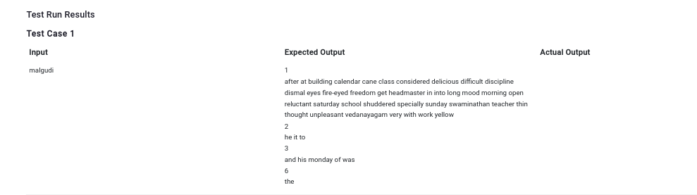

```
malgudi = ['It', 'was', 'Monday', 'morning.', 'Swaminathan', 'was', 'reluctant', 'to', 'open', 'his',
 'eyes.', 'He', 'considered', 'Monday', 'specially', 'unpleasant', 'in', 'the', 'calendar.', 'After',
 'the', 'delicious', 'freedom', 'of', 'Saturday', 'And', 'Sunday,', 'it', 'was', 'difficult', 'to',
 'get', 'into', 'the', 'Monday', 'mood', 'of', 'work', 'and', 'discipline.', 'He', 'shuddered', 'at',
 'the', 'very', 'thought', 'of', 'school:', 'the', 'dismal', 'yellow', 'building;', 'the',
 'fire-eyed', 'Vedanayagam,', 'his', 'class', 'teacher,', 'and', 'headmaster', 'with', 'his',
 'thin', 'long', 'cane...']
```
