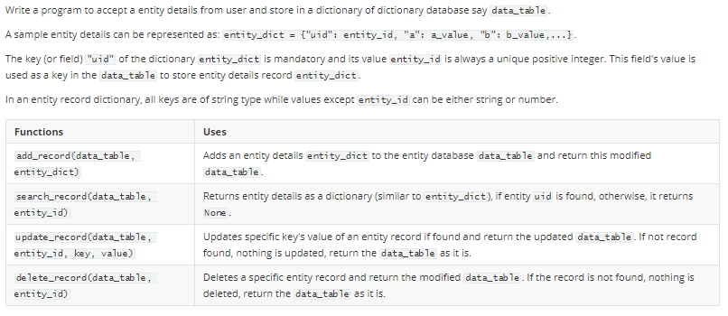
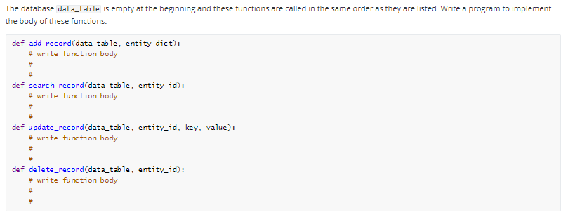

```
# uses json library
# convert an input dictionary string to dictionary object
import json
entity_dict = json.loads(input())
# accept entity_id as int input used in json dictionary string
entity_id = int(input())

# create a blank dictionary
data_table = {}        
# add a record
data_table = add_record(data_table, entity_dict)
print(data_table)
# search a record
print(search_record(data_table, entity_id))
# update a field in the existing record
data_table = update_record(data_table, entity_id, list(data_table[entity_id].keys())[1], "X")
print(data_table)
# delete a record
data_table = delete_record(data_table, entity_id)
print(data_table)
```