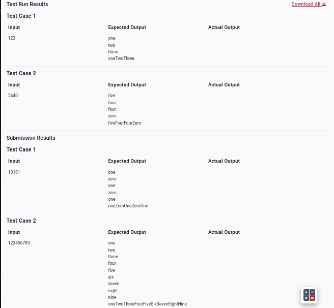

- Accept an integer as input and print the digits (as lower case words) present in it from left to right. Each digit should be printed on a separate line. At the end, print all the digits (as words) in a single line without space in camel case.

